# Lenochodi
Repositář pro týmovou práci z předmětu 4IT115

## Návod k prvnímu spuštění Gitu
1. Nainstaluj si Git v počítači, pokud ho ještě nemáš, [https://git-scm.com/downloads](https://git-scm.com/downloads), všude dávej Next.
2. Otevři si NetBeans, v horní liště je záložka *Team*, v té vyber možnost *Git* a následně *Clone...*

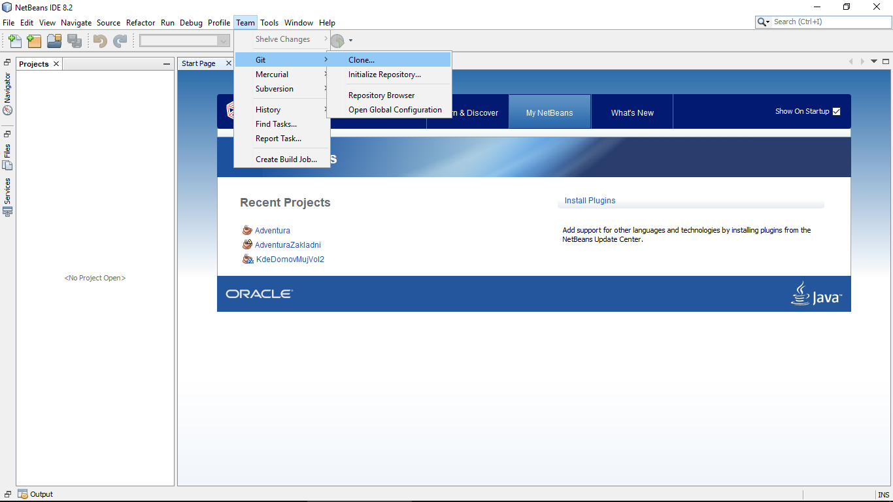

3. Vyskočí na tebe hrozivé okno. Jako adresu repozitáře vyplníš: https://github.com/lukazko/Lenochodi.git, pak vyplníš svůj GitHub nick a heslo. Dole nastavíš, kde v PC chceš mít repozitář uložený.

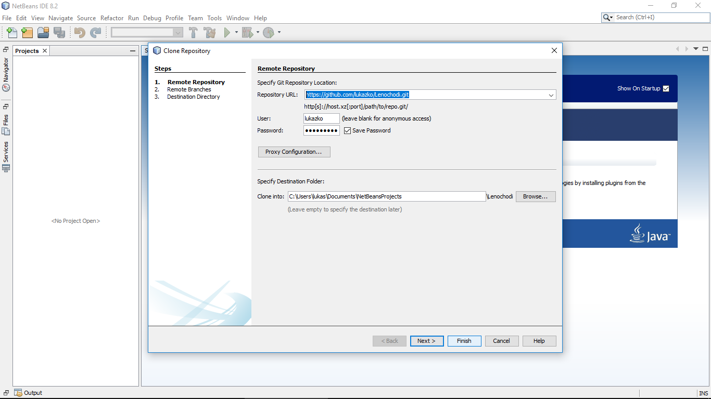

4. V následujícím okně si vybereš jaké větve chceš nakopírovat. Vyber jenom *master*, i když jich tam bude víc.

5. V posledním okně zkontroluj, že **Checkout branch** je *master* a odškrtni volbu **Scan for NetBeans...**

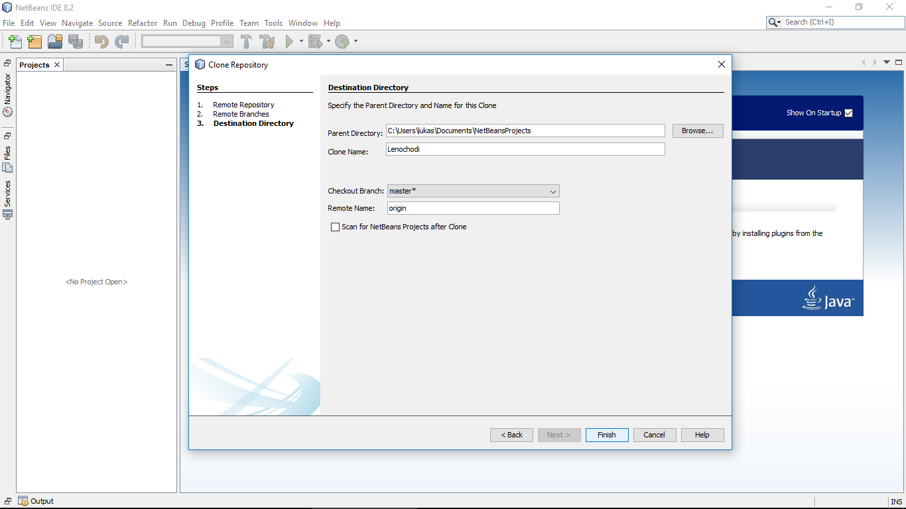

6. Teď máš stažený obsah hlavní větve (*master*) našeho projektu ve svém PC. Ale jelikož je nepraktické (a v našem případě i  nebezpečné) commitovat přímo do ní, tak si musíš založit svou vlastní větev, kterou pak budeme případně mergovat do hlavní (pokud projde mou "odbornou" kontrolou).
7. Vlastní větev založíš opět v záložce *Team -> Branch/Tag -> Create Branch...*

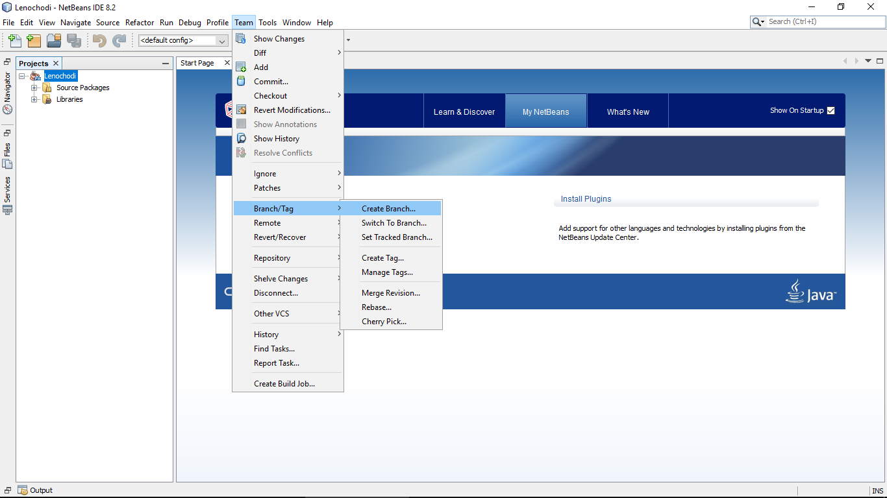

8. Jako jméno větve použij své křestní jméno bez diakritiky, zkontroluj zaškrtnutí **Checkout Created Branch** a můžeš dát *Create.*

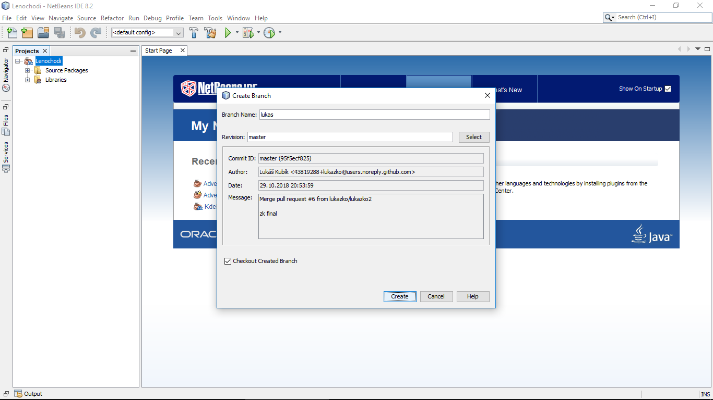

9. Všechno, co teď v kódu provedeš se děje pouze na tvé větvi a neovlivňuješ tak ostatní větve.
10. Otevři si stažený NetBeans projekt - normálně přes *Open Project* a najdi místo kam si ho nakopíroval.
11. Teď rozklikni hlavní třídu našeho projektu a dopiš do poznámky *@autor...* svoje jméno.

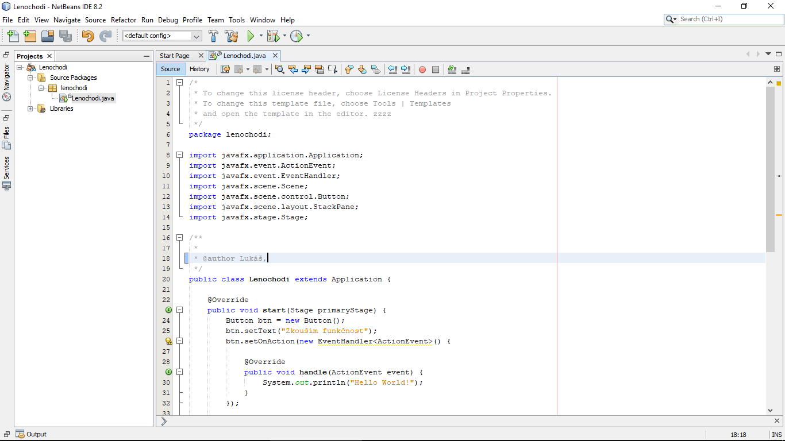

12. Změnu commitni (*Team -> Commit*, nebo tak, jak nás to učila Buchna).

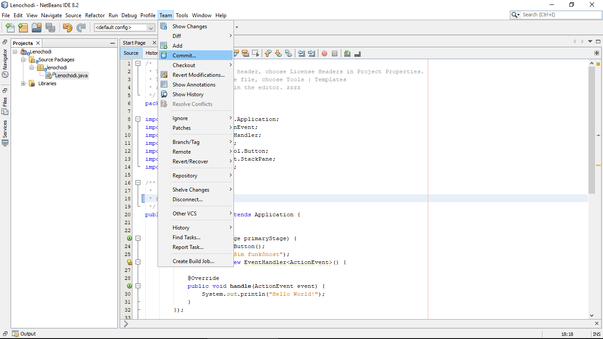
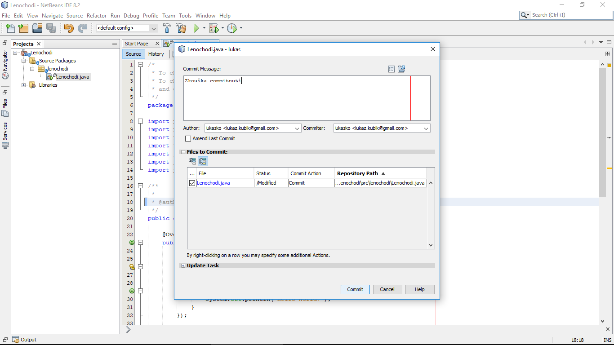

13. Takhle můžeš nacommitovat x změn, ale ty jsou pořád uloženy pouze na tvém lokálním úložišti.
14. Když budeš chtít, aby to viděli i ostatní, musíš to ještě pushnout na GitHub, či-li *Team -> Remote -> Push to Upstream*

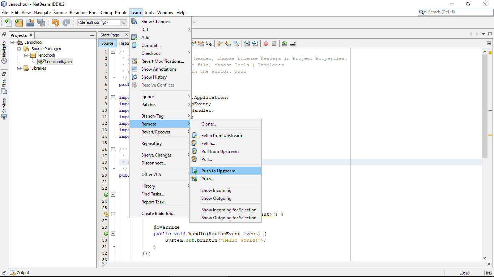

15. Jelikož to děláš poprvé, vyskočí na tebe dvě shitty tabulky, jen je potvrď.
16. Teď by mělo být hotovo, jdi na GitHub, do našeho repositáře [https://github.com/lukazko/Lenochodi], nad tou hnědou čarou můžeš spatřit tlačítko **branches**, na to klikni a vidíš všechny momentálně existující větve.

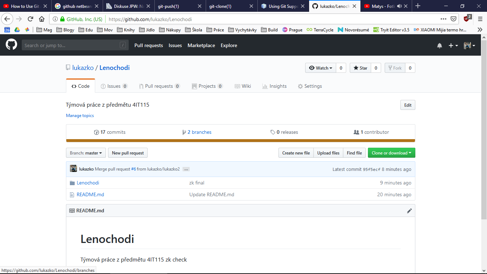

17. Najdi tu s tvým jménem a pokud se nic nepodělalo, tak bys tam měl vpravo mít možnost **New pull request**.

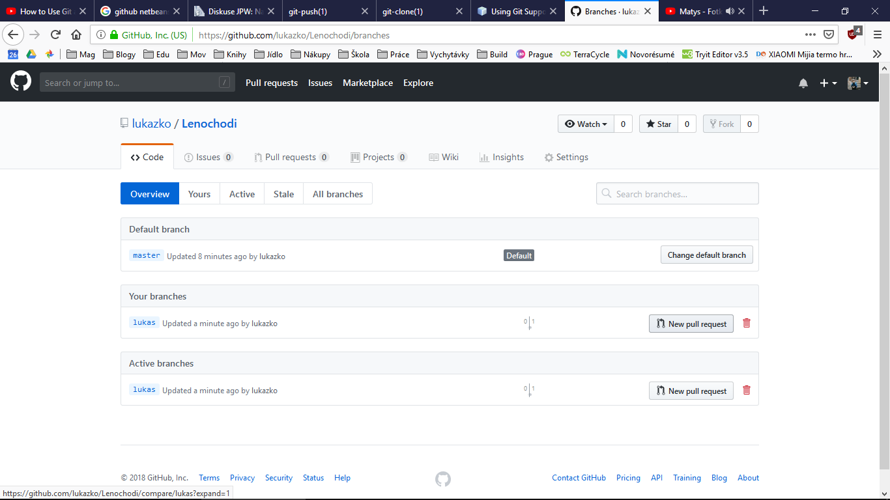

18. Teď v podstatě vytváříš žádost o zařazení svých změn do hlavní větve projektu, přidej krátkej popis změn a dej **Create pull request**, teď můžeme všichni vidět změny v kódu, diskutovat a případně žádost schváli a zařadit to tak do *master*u

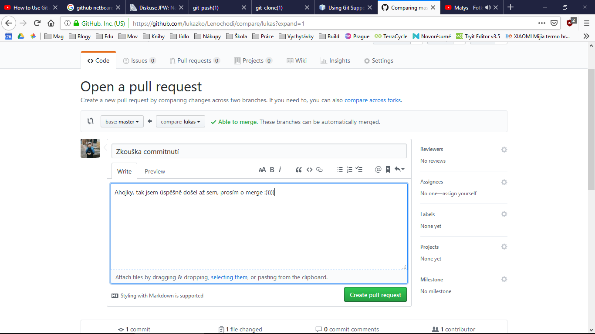

## Stažení současné verze
1. **Pokaždé** než začneš něco vytvářet, ujisti se, že máš současnou verzi kódu a že pracuješ na své větvi.
2. Stažení aktuální verze se dělá přes *Team -> Remote -> Fetch...*, a tam zvolíš **master -> origin/master**, nic jiného.

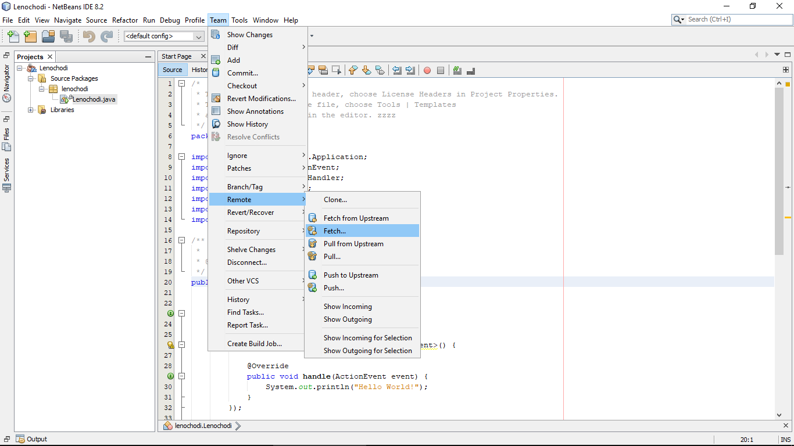
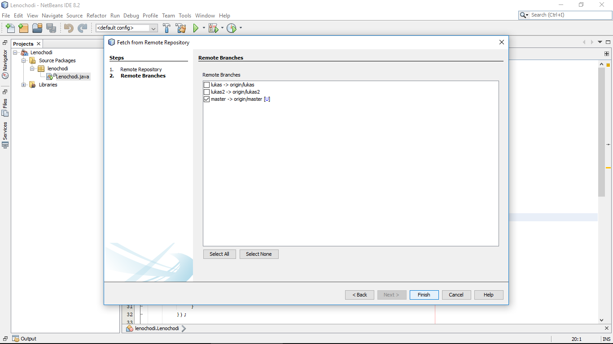

3. Tím si do PC dostal součanou verzi *master* větve, teď ještě přes *Team -> Remote -> Pull* nekopíruješ její obsah do své větve. Což se udělá opět volbou **master -> origin/master**.

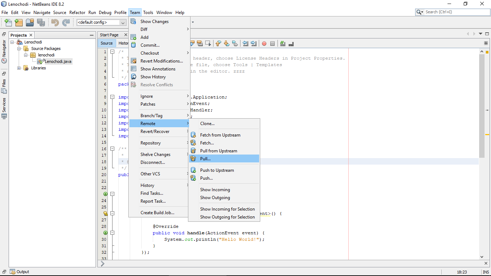

4. Hotovo a můžeš tvořit.

